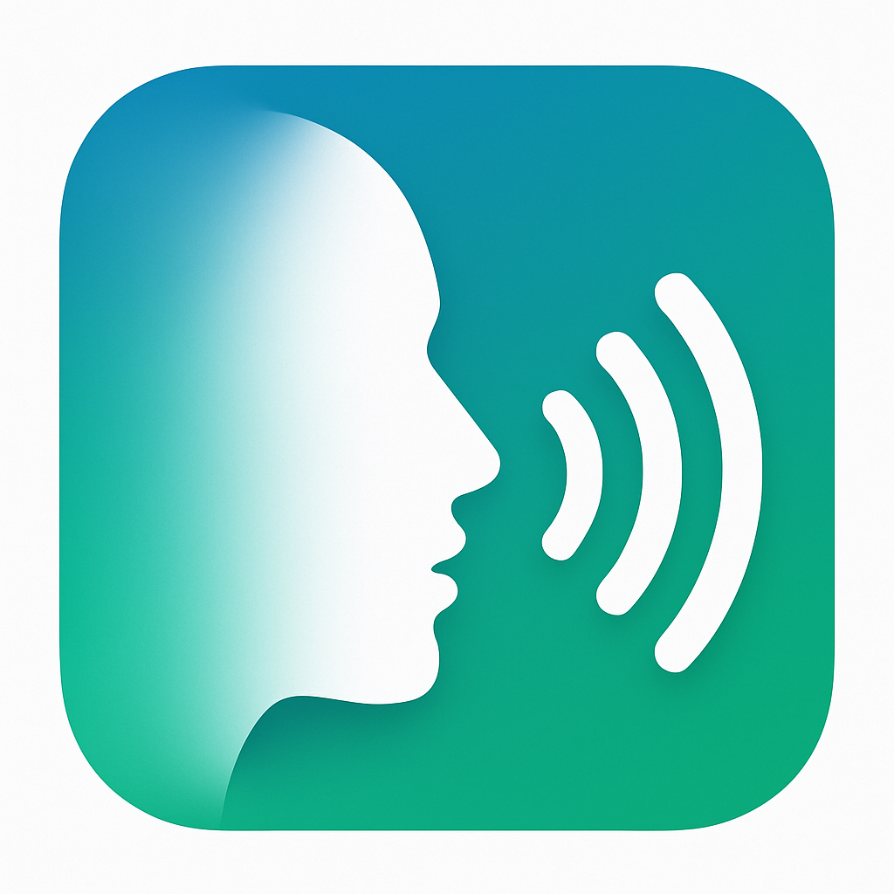

# Mervyn Talks - Voice Translation iOS App

<div align="center">
  
  
  **Break language barriers with voice-to-voice translation**
  
  [](https://developer.apple.com/ios/)
  [](https://swift.org/)
  [](https://firebase.google.com/)
  [](LICENSE)
</div>

## 🎯 Overview

Mervyn Talks is an intuitive iOS voice translation app that enables seamless communication across language barriers. Simply speak in your language and hear the translation instantly in your target language.

### 🔔 Latest updates (2025-08-08)

- Introduced a centered, modern hero header (`HeroHeader`) with two styles: `.card` (rounded all corners) and `.fullBleed`
- Added adaptive on-primary text/icon colors for perfect contrast in both light and dark mode
- Fixed layout issues with a professional design system:
  - Microphone button fixed at 130pt
  - Language selectors show full names with flags (≥ 140pt)
  - Title “Mervyn Talks” is centered and safe-area aware
- Guarded iOS 16-only APIs for iOS 15 compatibility

### ✨ Key Features

- **🎤 Voice-to-Voice Translation**: Speak naturally and hear translations instantly
- **🌍 Multi-Language Support**: Supports dozens of languages and dialects
- **🔥 Firebase Integration**: Cloud-powered translation with offline capabilities
- **📱 Native iOS Design**: Beautiful, intuitive interface following iOS design guidelines
- **🔒 Privacy-First**: Secure handling of voice data with user consent
- **⚡ Real-Time Processing**: Fast, accurate translations powered by advanced AI

## 🤖 **FOR AI CODING AGENTS**

**🔥 NEW AI AGENTS START HERE:**

1. **📋 [AI_AGENT_ONBOARDING.md](AI_AGENT_ONBOARDING.md)** - **REQUIRED READING**: Complete project overview, architecture, and development practices
2. **📍 [PROJECT_NAVIGATION.md](PROJECT_NAVIGATION.md)** - Quick navigation index and file finder
3. **🚀 [DEVELOPMENT_QUICK_START.md](DEVELOPMENT_QUICK_START.md)** - Immediate development workflow

**These documents will bring you up to speed on our professional development environment, GitFlow workflow, testing strategy, and codebase architecture.**

---

## 🚀 Getting Started

### Prerequisites

- **Xcode 15.0+**
- **iOS 15.0+** deployment target
- **Swift 5.9+**
- **Firebase Project** (configured)
- **Apple Developer Account** (for device testing and App Store submission)
- **Docker** (for backend development)
- **Python 3.11+** (for backend development)

### Installation

1. **Clone the repository**
   ```bash
   git clone <your-repository-url>
   cd UniversalTranslatorApp
   ```

2. **Open in Xcode**
   ```bash
   cd iOS
   open UniversalTranslator.xcodeproj
   ```

3. **Configure Firebase**
   - Ensure `GoogleService-Info.plist` is present in the project
   - Firebase packages are automatically managed via Swift Package Manager

4. **Build and Run**
   - Select your target device or simulator
   - Press `Cmd+R` to build and run

## 🏗️ Architecture

### Project Structure
```
UniversalTranslatorApp/
├── iOS/                          # iOS app source code
│   ├── UniversalTranslator.xcodeproj
│   ├── Assets.xcassets/          # App icons and visual assets
│   ├── Info.plist               # App configuration
│   └── GoogleService-Info.plist # Firebase configuration
├── AppStore/                     # App Store submission materials
│   ├── APP_STORE_LISTING.md     # Store listing content
│   ├── PRIVACY_POLICY.md        # Privacy policy
│   └── TERMS_OF_SERVICE.md      # Terms of service
└── Documentation/               # Technical documentation
```

### Dependencies

- **Firebase iOS SDK** (via Swift Package Manager)
  - FirebaseAnalytics
  - FirebaseFirestore
  - FirebaseStorage
- **Speech Recognition Framework**
- **AVFoundation Framework**

## 🎨 App Icon

The app features a custom-designed icon that represents the core functionality of voice translation and global communication. The icon was updated on August 5, 2025, with a user-provided custom design.

### Icon Specifications
- **Sizes**: 15 different sizes from 20x20 to 1024x1024 pixels
- **Format**: PNG with transparency support
- **Design**: Custom user-provided design optimized for iOS
- **Backup**: Original teal-to-blue gradient design preserved in backup

## 📱 App Store Submission

### Current Status: **Ready for Submission** ✅

The app is fully prepared for App Store submission with:

- ✅ **Custom app icon** integrated and tested
- ✅ **Firebase integration** verified and working
- ✅ **Export compliance** configured (ITSAppUsesNonExemptEncryption: NO)
- ✅ **Screenshots generated** for all required device sizes
- ✅ **App Store metadata** prepared and ready
- ✅ **Archive build** created and validated
- ✅ **Privacy policy and terms** finalized

### Submission Materials

All App Store submission materials are located in the `/AppStore` directory:
- App Store listing content
- Screenshots for all device sizes
- Privacy policy and terms of service
- App preview video script
- Metadata package for App Store Connect

## 🛠️ Development

### Building the App

```bash
# Clean build for simulator
xcodebuild -project UniversalTranslator.xcodeproj -scheme UniversalTranslator -configuration Debug -sdk iphonesimulator clean build

# Build for device
xcodebuild -project UniversalTranslator.xcodeproj -scheme UniversalTranslator -configuration Release -sdk iphoneos build

# Create archive for App Store
xcodebuild -project UniversalTranslator.xcodeproj -scheme UniversalTranslator -configuration Release -sdk iphoneos archive -archivePath SpeakEasy.xcarchive
```

### Updating App Icon

Use the included script to replace the app icon:

```bash
cd iOS
./replace_app_icon.sh
```

The script automatically:
- Creates a backup of existing icons
- Generates all 15 required iOS icon sizes
- Updates the AppIcon.appiconset
- Maintains proper file naming conventions

### Testing

The app has been tested on:
- ✅ iOS Simulator (multiple device sizes)
- ✅ Real iPhone device
- ✅ Firebase integration verified
- ✅ Voice recognition and translation functionality
- ✅ App Store build validation

## 🔧 Troubleshooting

### Common Issues

1. **Xcode Dependency Graph Error**
   - Clean DerivedData: `rm -rf ~/Library/Developer/Xcode/DerivedData`
   - Reset Swift Package Manager cache
   - Use command-line builds as alternative

2. **Firebase Package Issues**
   - Verify `GoogleService-Info.plist` is included
   - Check Swift Package Manager references
   - Clean and rebuild project

3. **App Icon Not Displaying**
   - Verify `CFBundleIcons` configuration in Info.plist
   - Ensure all icon sizes are present in AppIcon.appiconset
   - Clean and rebuild project

## 📄 License

This project is licensed under the MIT License - see the [LICENSE](LICENSE) file for details.

## 🤝 Contributing

1. Fork the repository
2. Create a feature branch (`git checkout -b feature/amazing-feature`)
3. Commit your changes (`git commit -m 'Add amazing feature'`)
4. Push to the branch (`git push origin feature/amazing-feature`)
5. Open a Pull Request

## 📞 Support

For support and questions:
- **Email**: support@speakeasy.app
- **Documentation**: See `/Documentation` directory
- **Issues**: Create an issue in this repository

## 🎉 Acknowledgments

- Firebase team for excellent iOS SDK
- Apple for Speech Recognition and AVFoundation frameworks
- The open-source community for inspiration and tools

---

**Mervyn Talks** - Breaking language barriers, one conversation at a time. 🌍🗣️
