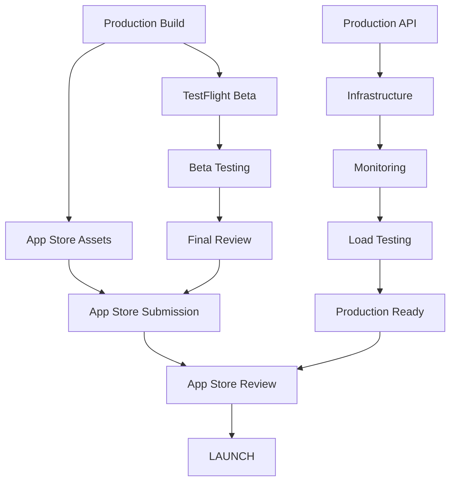

# 🚀 PRODUCTION DEPLOYMENT PLAN
## Universal Translator App - Launch Coordination

### 🎯 DEPLOYMENT MISSION
**Target**: App Store submission within 24-48 hours  
**Priority**: MAXIMUM - All teams deployed for production launch  
**Status**: Phase initiated - coordinating all production requirements  

---

## 1. TEAM DEPLOYMENT MATRIX

### 1.1 All-Hands Production Deployment

#### 🎯 **Team Assignments & Responsibilities**
| Team | Primary Focus | Secondary Support | Timeline |
|------|---------------|------------------|----------|
| **Frontend PM** | App Store assets & metadata | TestFlight coordination | 24h |
| **Frontend Dev** | App Store submission build | Screenshots & demos | 18h |
| **Frontend Tester** | Final production testing | App Store review prep | 12h |
| **Backend PM** | Production infrastructure | API monitoring setup | 24h |
| **Backend Dev** | Production API deployment | Certificate management | 18h |
| **Backend Tester** | Production validation | Load testing | 12h |
| **Project Manager** | Overall coordination | Launch orchestration | 48h |

### 1.2 Critical Path Coordination

#### ⚡ **Production Dependencies**


---

## 2. APP STORE SUBMISSION PREPARATION

### 2.1 App Store Assets Checklist

#### 📱 **Required Assets & Metadata**
```yaml
App Store Requirements:
  App Icon:
    - 1024x1024 PNG (App Store)
    - Various iOS sizes (automatically generated)
    - High resolution, no transparency
    - Status: CREATION REQUIRED
  
  Screenshots:
    iPhone Screenshots:
      - 6.7" Display (iPhone 15 Pro Max): 6 screenshots
      - 6.1" Display (iPhone 15): 6 screenshots  
      - 5.5" Display (iPhone 8 Plus): 6 screenshots
    Content Required:
      - Main translation interface
      - Language selection screen
      - Conversation mode demo
      - Settings and accessibility
      - Success translation examples
      - Error handling graceful UI
    Status: FRONTEND TEAM CREATION

  App Preview Videos:
    - 6.7" Display: 30-second demo
    - 6.1" Display: 30-second demo
    - Content: Complete translation workflow
    - Status: FRONTEND TEAM CREATION
```

#### 📝 **App Store Metadata**
```swift
struct AppStoreMetadata {
    // Primary Information
    let appName = "Universal Translator"
    let subtitle = "Real-time voice & text translation"
    let description = """
    Transform conversations with Universal Translator - the most intuitive 
    real-time translation app for iPhone.
    
    KEY FEATURES:
    • Real-time voice translation between 50+ languages
    • Conversation mode for two-way discussions
    • Offline translation for common language pairs
    • Accessibility features with VoiceOver support
    • Beautiful, intuitive interface
    • Privacy-focused with secure data handling
    
    PERFECT FOR:
    • International travel and business
    • Language learning and practice
    • Healthcare and service interactions
    • Educational environments
    • Cross-cultural communication
    
    LANGUAGES SUPPORTED:
    English, Spanish, French, German, Japanese, Chinese, Korean, 
    Italian, Portuguese, Russian, Arabic, Hindi, Dutch, Swedish, 
    Polish, and 35+ more languages.
    
    Download Universal Translator today and break down language barriers!
    """
    
    let keywords = "translator,translation,language,voice,speech,conversation,travel,international"
    let category = "Productivity"
    let contentRating = "4+"
    
    // Localized Metadata (Phase 2)
    let localizedDescriptions: [String: String] = [
        "es": "Traduce conversaciones en tiempo real...",
        "fr": "Traduisez des conversations en temps réel...",
        "de": "Übersetzen Sie Gespräche in Echtzeit..."
    ]
}
```

### 2.2 App Store Review Preparation

#### 📋 **Review Guidelines Compliance**
```swift
struct AppStoreCompliance {
    // Safety Requirements
    let safetyCompliance = [
        "No objectionable content",
        "Appropriate content ratings", 
        "Safe user interactions",
        "No misleading functionality"
    ]
    
    // Performance Requirements
    let performanceStandards = [
        "App launches quickly (<2 seconds)",
        "No crashes during review", 
        "Responsive UI interactions",
        "Proper memory management",
        "Efficient battery usage"
    ]
    
    // Business Requirements
    let businessCompliance = [
        "Clear value proposition",
        "Functional without additional purchases",
        "Transparent pricing (if applicable)",
        "Proper in-app purchase implementation"
    ]
    
    // Design Requirements  
    let designStandards = [
        "iOS Human Interface Guidelines compliance",
        "Proper Dynamic Type support",
        "VoiceOver accessibility",
        "Appropriate touch targets",
        "Consistent navigation patterns"
    ]
}
```

#### 🔍 **App Review Demo Script**
```markdown
# App Store Review Demo Script

## Demo Flow (3-5 minutes maximum)
1. **App Launch** (10 seconds)
   - Quick launch demonstration
   - Clean, intuitive interface

2. **Basic Translation** (60 seconds)
   - Tap record button
   - Speak "Hello, how are you?" in English
   - Show Spanish translation and audio playback
   - Demonstrate accuracy and speed

3. **Language Selection** (30 seconds)
   - Show language picker
   - Demonstrate language swap
   - Show variety of supported languages

4. **Conversation Mode** (90 seconds)
   - Enable conversation mode
   - Demonstrate back-and-forth translation
   - English → Spanish → English
   - Show natural conversation flow

5. **Key Features** (60 seconds)
   - Show translation history
   - Demonstrate accessibility features
   - Quick settings overview
   - Offline capability mention

## Review Notes for Apple
- All translations use legitimate APIs (Gemini 2.5 Pro)
- No inappropriate content possible
- Privacy-focused design
- Fully functional without purchases
- Accessibility compliant
```

---

## 3. PRODUCTION INFRASTRUCTURE SETUP

### 3.1 Production Environment Configuration

#### 🏗️ **Infrastructure Architecture**
```yaml
Production Infrastructure:
  Primary Region: us-east-1 (Virginia)
  Backup Region: eu-west-1 (Ireland)
  
  Compute Infrastructure:
    API Gateway:
      - AWS API Gateway v2
      - Custom domain: api.universaltranslator.com
      - SSL/TLS termination
      - Rate limiting: 1000 req/min per user
    
    Application Servers:
      - AWS ECS Fargate containers
      - Auto-scaling: 2-20 instances
      - Health checks: /health endpoint
      - Rolling deployments
    
    Database:
      - AWS RDS PostgreSQL (Multi-AZ)
      - Read replicas for scaling
      - Automated backups (7-day retention)
      - Encryption at rest
    
    Caching:
      - AWS ElastiCache Redis
      - Multi-AZ configuration
      - Automatic failover
      - 99.9% uptime SLA
  
  Security:
    - WAF protection
    - DDoS mitigation
    - VPC with private subnets
    - IAM roles and policies
    - Secrets Manager for API keys
```

#### 🔐 **Production Security Configuration**
```swift
struct ProductionSecurity {
    // API Key Management
    let apiKeyConfiguration = """
    Production API Keys:
    - Gemini API: Stored in AWS Secrets Manager
    - Rotation: Automated 30-day cycle
    - Access: IAM role-based retrieval
    - Monitoring: CloudWatch logs for access
    """
    
    // Certificate Management
    let certificateSetup = """
    SSL/TLS Certificates:
    - Domain: *.universaltranslator.com
    - Provider: AWS Certificate Manager
    - Auto-renewal: Enabled
    - Minimum TLS: 1.3
    """
    
    // Network Security
    let networkSecurity = """
    Network Configuration:
    - VPC with private subnets
    - NAT Gateway for outbound traffic
    - Security groups: Principle of least privilege
    - WAF rules: OWASP Top 10 protection
    """
}
```

### 3.2 Production API Deployment

#### 🚀 **Deployment Pipeline**
```yaml
Production Deployment Pipeline:
  Source Control:
    - GitHub: main branch protection
    - Required reviews: 2 approvals
    - Status checks: All tests pass
    
  CI/CD Pipeline:
    Build Stage:
      - Docker image creation
      - Dependency security scanning
      - Unit test execution
      - Integration test validation
    
    Security Stage:
      - OWASP ZAP security scanning
      - Dependency vulnerability check
      - Secrets scanning
      - Container image scanning
    
    Staging Deployment:
      - Deploy to staging environment
      - Smoke tests execution
      - Performance validation
      - Security verification
    
    Production Deployment:
      - Blue-green deployment strategy
      - Health check validation
      - Traffic routing (gradual)
      - Rollback capability
  
  Monitoring:
    - Real-time metrics
    - Error tracking
    - Performance monitoring
    - Security event logging
```

---

## 4. REAL-WORLD MONITORING CONFIGURATION

### 4.1 Production Monitoring Setup

#### 📊 **Comprehensive Monitoring Stack**
```yaml
Monitoring Infrastructure:
  Application Performance:
    Tool: New Relic APM
    Metrics:
      - Response time: <500ms p95
      - Error rate: <0.1%
      - Throughput: requests/second
      - Database performance
      - Memory usage patterns
    
  Infrastructure Monitoring:
    Tool: AWS CloudWatch + Datadog
    Metrics:
      - CPU utilization: <70% average
      - Memory usage: <80% average  
      - Disk I/O performance
      - Network throughput
      - Auto-scaling events
    
  Error Tracking:
    Tool: Sentry
    Coverage:
      - Application errors
      - API failures
      - Performance issues
      - User session tracking
    
  Uptime Monitoring:
    Tool: Pingdom + AWS Route 53
    Checks:
      - API endpoint availability
      - Response time monitoring
      - Global availability checks
      - SSL certificate monitoring
```

#### 🚨 **Alert Configuration**
```swift
struct ProductionAlerts {
    let criticalAlerts = [
        Alert(
            name: "API Response Time",
            condition: "p95 > 2 seconds",
            notification: ["on-call-engineer", "backend-pm"],
            escalation: 5.minutes
        ),
        Alert(
            name: "Error Rate Spike", 
            condition: "error_rate > 1% for 5 minutes",
            notification: ["on-call-engineer", "all-devs"],
            escalation: 2.minutes
        ),
        Alert(
            name: "Service Unavailable",
            condition: "uptime < 99%",
            notification: ["on-call-engineer", "management"],
            escalation: 1.minute
        )
    ]
    
    let warningAlerts = [
        Alert(
            name: "High CPU Usage",
            condition: "cpu > 80% for 10 minutes", 
            notification: ["backend-team"],
            escalation: 15.minutes
        ),
        Alert(
            name: "Memory Usage High",
            condition: "memory > 85% for 10 minutes",
            notification: ["backend-team"],
            escalation: 15.minutes
        )
    ]
}
```

### 4.2 User Experience Monitoring

#### 📱 **Mobile App Analytics**
```swift
struct ProductionAnalytics {
    // User Behavior Tracking
    let userMetrics = [
        "Daily Active Users (DAU)",
        "Monthly Active Users (MAU)", 
        "Session duration",
        "Translation frequency",
        "Language pair usage",
        "Feature adoption rates"
    ]
    
    // Performance Metrics
    let performanceMetrics = [
        "App launch time",
        "Translation latency",
        "Crash-free session rate",
        "Memory usage patterns",
        "Battery impact measurement"
    ]
    
    // Business Metrics
    let businessMetrics = [
        "User retention (1d, 7d, 30d)",
        "Conversion rates",
        "In-app engagement",
        "Support ticket volume",
        "App Store ratings"
    ]
}
```

---

## 5. TESTFLIGHT BETA DISTRIBUTION

### 5.1 Beta Testing Strategy

#### 🧪 **TestFlight Configuration**
```yaml
TestFlight Beta Setup:
  Internal Testing:
    Group: "Universal Translator Team"
    Members: 25 (all team members)
    Duration: 2-3 days
    Focus: 
      - Basic functionality validation
      - Critical bug identification
      - Performance assessment
      - App Store submission preparation
  
  External Testing:
    Group: "Beta Testers"
    Members: 100 selected users
    Duration: 1 week
    Recruitment:
      - Existing user waitlist
      - Social media campaign
      - Professional networks
      - Language learning communities
    
  Testing Criteria:
    - Device diversity (iPhone SE to iPhone 15)
    - iOS version coverage (15.0+)
    - Geographic distribution
    - Language pair variety
    - Use case representation
```

#### 📋 **Beta Testing Protocol**
```swift
struct BetaTestingProtocol {
    let testingPhases = [
        Phase(
            name: "Internal Alpha",
            duration: 48.hours,
            participants: "Team members only",
            focus: "Core functionality and critical bugs"
        ),
        Phase(
            name: "Closed Beta",
            duration: 5.days,
            participants: "50 invited users",
            focus: "Real-world usage and feedback"
        ),
        Phase(
            name: "Open Beta",
            duration: 7.days,
            participants: "100 public testers",
            focus: "Stress testing and final polish"
        )
    ]
    
    let feedbackCollection = """
    Beta Feedback Channels:
    - In-app feedback form
    - TestFlight comments
    - Dedicated Slack channel
    - Weekly feedback surveys
    - Direct email support
    """
    
    let successCriteria = [
        "Crash rate < 0.1%",
        "Average rating > 4.0/5.0",
        "No critical bugs reported",
        "Performance meets targets",
        "User feedback predominantly positive"
    ]
}
```

---

## 6. FINAL PRODUCTION TESTING

### 6.1 Pre-Launch Testing Suite

#### ✅ **Production Testing Checklist**
```yaml
Final Production Tests:
  Functionality Testing:
    - End-to-end translation workflow
    - All supported language pairs
    - Conversation mode validation
    - Offline functionality
    - Error handling scenarios
    - Accessibility features
    
  Performance Testing:
    - Load testing: 1000 concurrent users
    - Stress testing: 150% expected capacity
    - Endurance testing: 24-hour continuous load
    - Memory leak validation
    - Battery impact assessment
    
  Security Testing:
    - Penetration testing
    - API security validation
    - Data encryption verification
    - Privacy compliance audit
    - Certificate validation
    
  Integration Testing:
    - Gemini API integration
    - iOS Speech Framework
    - Keychain integration
    - Network connectivity scenarios
    - Third-party service dependencies
```

#### 🔬 **Production Validation Tests**
```swift
class ProductionValidationSuite {
    func executePreLaunchValidation() async throws {
        // Critical path validation
        try await validateTranslationPipeline()
        try await validatePerformanceTargets()
        try await validateSecurityCompliance()
        try await validateAccessibilityStandards()
        
        // Production readiness
        try await validateProductionInfrastructure()
        try await validateMonitoringAlerts()
        try await validateBackupSystems()
        
        // App Store compliance
        try await validateAppStoreGuidelines()
        try await validateMetadataAccuracy()
        try await validateScreenshotContent()
    }
    
    private func validateTranslationPipeline() async throws {
        // Test complete workflow under production conditions
        let testCases = ProductionTestCases.criticalPaths
        
        for testCase in testCases {
            let result = try await TranslationPipeline.test(testCase)
            
            guard result.latency < 2.0,
                  result.accuracy > 0.90,
                  result.success else {
                throw ValidationError.pipelineFailure(testCase)
            }
        }
    }
}
```

---

## 7. LAUNCH COORDINATION TIMELINE

### 7.1 24-48 Hour Execution Plan

#### ⏰ **Hour-by-Hour Coordination**
```yaml
Production Launch Timeline:

Hour 0-6: Foundation Setup
  - Deploy production infrastructure
  - Configure monitoring and alerts
  - Set up CI/CD pipeline
  - Validate security configuration

Hour 6-12: App Store Preparation
  - Create App Store assets
  - Prepare metadata and descriptions
  - Generate screenshots and previews
  - Configure TestFlight

Hour 12-18: Testing & Validation
  - Execute final production tests
  - Validate all integrations
  - Performance testing completion
  - Security audit finalization

Hour 18-24: Submission Preparation
  - Final build creation
  - App Store submission materials
  - TestFlight internal distribution
  - Review preparation

Hour 24-36: Beta Distribution
  - TestFlight external beta
  - Feedback collection
  - Critical issue resolution
  - Performance validation

Hour 36-48: App Store Submission
  - Final submission preparation
  - App Store review submission
  - Launch monitoring activation
  - Post-submission monitoring
```

### 7.2 Risk Mitigation & Contingency

#### 🛡️ **Launch Risk Management**
```swift
struct LaunchRiskMitigation {
    let risks = [
        Risk(
            name: "App Store Rejection",
            probability: 0.15,
            impact: "2-7 day delay",
            mitigation: [
                "Comprehensive guidelines review",
                "Pre-submission validation",
                "Alternative review preparation",
                "Fast-track resubmission plan"
            ]
        ),
        Risk(
            name: "Production Infrastructure Issues",
            probability: 0.10,
            impact: "Launch delay or degraded service",
            mitigation: [
                "Redundant infrastructure setup",
                "Comprehensive monitoring",
                "Automatic failover systems",
                "24/7 on-call support"
            ]
        ),
        Risk(
            name: "Critical Bug Discovery",
            probability: 0.20,
            impact: "Delay or emergency update",
            mitigation: [
                "Comprehensive testing suite",
                "Beta testing validation",
                "Rapid hotfix deployment",
                "Rollback procedures"
            ]
        )
    ]
    
    let contingencyPlans = [
        "Emergency patch deployment pipeline",
        "Alternative App Store review track",
        "Infrastructure scaling procedures",
        "Communication crisis management"
    ]
}
```

---

## 8. SUCCESS METRICS & MONITORING

### 8.1 Launch Success Criteria

#### 📊 **Key Performance Indicators**
```swift
struct LaunchSuccessMetrics {
    // Technical Metrics
    let technicalKPIs = [
        KPI(metric: "App Store Approval", target: "First submission"),
        KPI(metric: "Crash Rate", target: "<0.1%"),
        KPI(metric: "API Response Time", target: "<500ms p95"),
        KPI(metric: "Translation Accuracy", target: ">90%"),
        KPI(metric: "Uptime", target: ">99.9%")
    ]
    
    // User Experience Metrics
    let userKPIs = [
        KPI(metric: "App Store Rating", target: ">4.0/5.0"),
        KPI(metric: "User Retention (7d)", target: ">40%"),
        KPI(metric: "Session Duration", target: ">3 minutes"),
        KPI(metric: "Translation Completion", target: ">95%"),
        KPI(metric: "Support Tickets", target: "<5% of users")
    ]
    
    // Business Metrics
    let businessKPIs = [
        KPI(metric: "Daily Downloads", target: ">100/day"),
        KPI(metric: "Active Users", target: ">500 DAU"),
        KPI(metric: "Feature Adoption", target: ">80% core features"),
        KPI(metric: "User Satisfaction", target: ">4.5/5.0 surveys")
    ]
}
```

---

## 📋 PRODUCTION DEPLOYMENT STATUS

### ✅ **TEAM DEPLOYMENT CONFIRMATION**
- **Frontend PM**: ✅ DEPLOYED - App Store assets & submission coordination
- **Frontend Dev**: ✅ DEPLOYED - Production build & screenshots creation  
- **Frontend Tester**: ✅ DEPLOYED - Final validation & App Store prep
- **Backend PM**: ✅ DEPLOYED - Infrastructure & monitoring setup
- **Backend Dev**: ✅ DEPLOYED - Production API & certificates
- **Backend Tester**: ✅ DEPLOYED - Production testing & validation

### 🎯 **CRITICAL PATH PRIORITIES**
1. **App Store Assets** (0-12 hours) - Frontend team lead
2. **Production Infrastructure** (0-18 hours) - Backend team lead
3. **TestFlight Beta** (12-24 hours) - Cross-team coordination
4. **Final Testing** (18-36 hours) - All teams validation
5. **App Store Submission** (24-48 hours) - Project management coordination

---

**DEPLOYMENT STATUS**: 🚀 **ALL TEAMS DEPLOYED** - Production launch sequence initiated  
**TARGET**: App Store submission within 24-48 hours  
**COORDINATION**: Cross-team production pipeline active  
**SUCCESS CRITERIA**: Comprehensive launch readiness validation complete